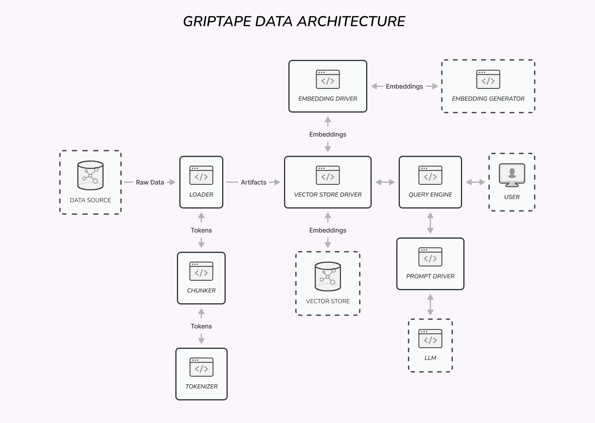

## Overview
Griptape provides several abstractions for working with data.

[Artifacts](./artifacts.md) are used for passing different types of data, such as text, lists, and blobs, between Griptape components.

[Embedding Drivers](../drivers/embedding-drivers.md) are used to generate vector embeddings from text.

[Loaders](./loaders.md) are used to load textual data from different sources.

[Chunkers](./chunkers.md) are used to split arbitrarily long text into chunks of certain token length.

**Tokenizers** are used to tokenize and detokenize text in order to track LLM token limits.

[Query Engines](../engines/query-engines.md) are used to search text storages.

[Vector Store Drivers](../drivers/vector-store-drivers.md) are used to store and query vector databases.

[Prompt Drivers](../drivers/prompt-drivers.md) are used to call LLM APIs.
